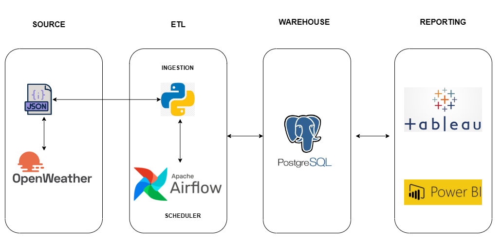

# Weather Data Engineering Project
## Introduction
In this project, we will execute an end-to-End data engineering project on real-time weather data.

We are going to use different technologies, such as Python, Apache Airflow, and PostgreSQL.

## Architecture

## Techonologies Used
- Python
- Apache Airflow
- PostgreSQL
- PowerBI

## Dataset
You can use any dataset you want because there are many open APIs available; here is a link to one of them.  - https://github.com/public-apis/public-apis

The dataset I have used is OpenWeatherMap.- https://github.com/public-apis/public-apis#weather
